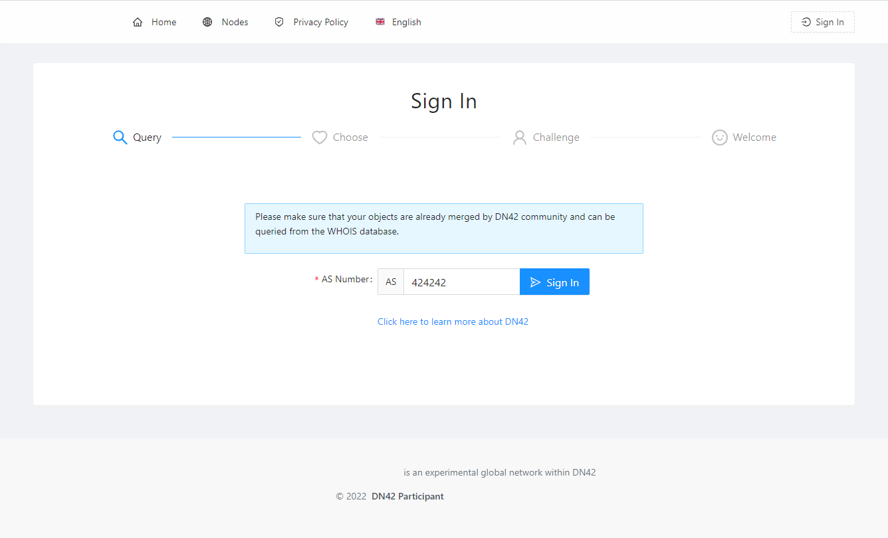
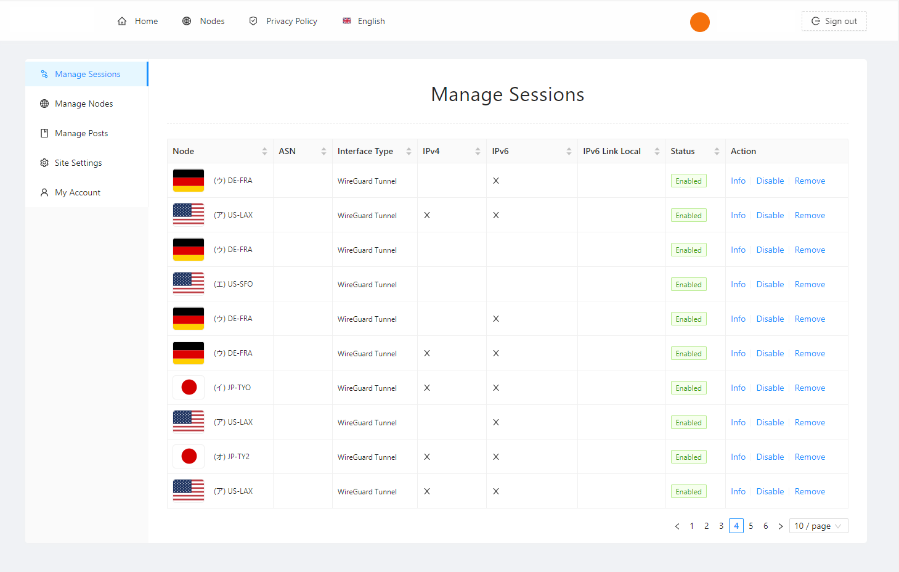
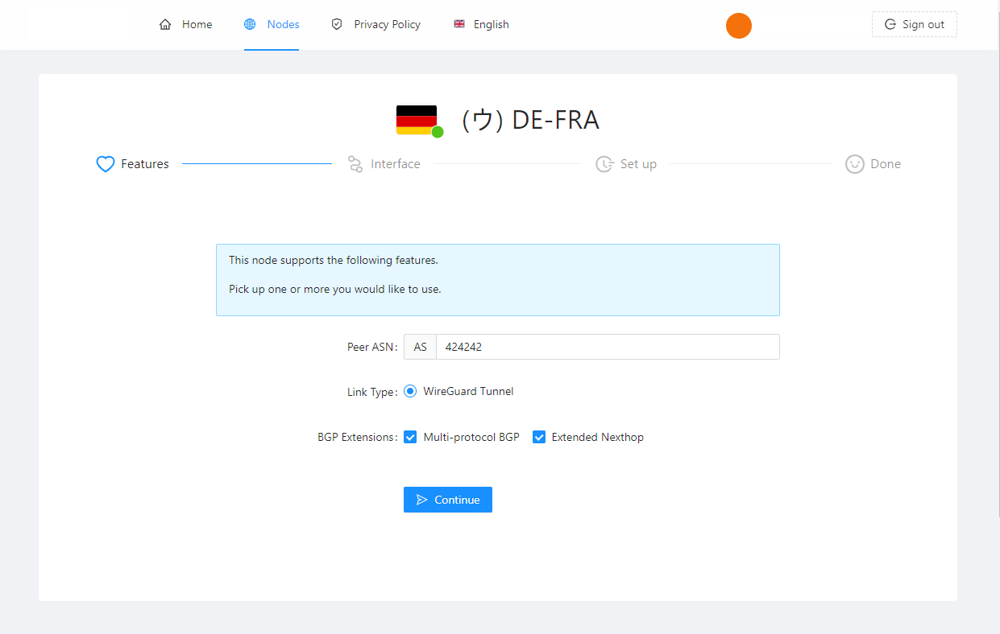
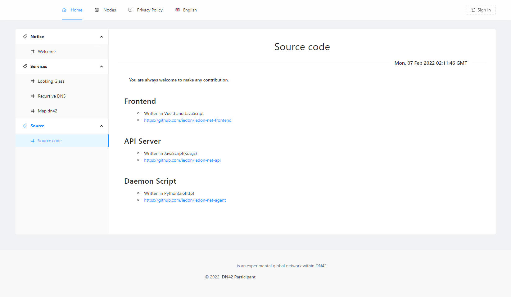

# IEDON-NET AUTO PEERING

This is IEDON-NET's DN42 Auto Peering System implementation.

## Build

```bash
bun install
bun run build
# Built bundles are located in ./dist
# Remember to modify ./src/config.ts
```

## Screenshots








